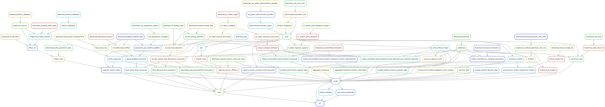

# Motivation

In recent years, energy modelling research has made efforts to improve the transparency of the modelling process, with multiple open-source workflows surfacing as proposed approaches to salvage this gap. Unfortunately, such workflows do not always lead to scientific refinement, either due to lack of maintenance, due to model-specific characteristics impeding their re-use, or due an ever-growing complexity turning them into black boxes where assumptions are difficult to ascertain.

Although each model has its own needs and characteristics, the data needed by them is often similar (demand profiles, existing capacity, land availability limits, etc).
The current approach of model-specific workflows hampers progress in two ways.

1. **By making sharing methodological improvements more difficult** since processes are "locked-in" to a specific framework, leading to a lot of re-implementation between communities, which is error prone and makes studies difficult to evaluate.
2. **By making model workflows less comprehensible over time** since they tend to grow in size and complexity as more studies are conducted with them, eventually turning into [black boxes](https://doi.org/10.1088/2516-1083/ad371e), increasing the risk of combining incompatible assumptions or using depreciated data.

Energy research is hardly the only field were this is a problem: bioinformatics and atmospheric modelling face similar problems.
This project aims to outline a framework for a modular approach to generating the constituent data for energy system models as well tying them together into a feature-complete, ready-to-run model. We focus in particular on:

- Separating valuable software tools, datasets, and data processing steps into modular components that improve their potential reusability. Defining a set of requirements that increase the cross-compatibility and ease of understanding of software tools, datasets, and data processing steps in a model-agnostic way, following the standards of FAIR science.
- Reducing the duplication of work by allowing a mix-and-match approach to consuming data from independently maintained and updated modular data generation workflows.
