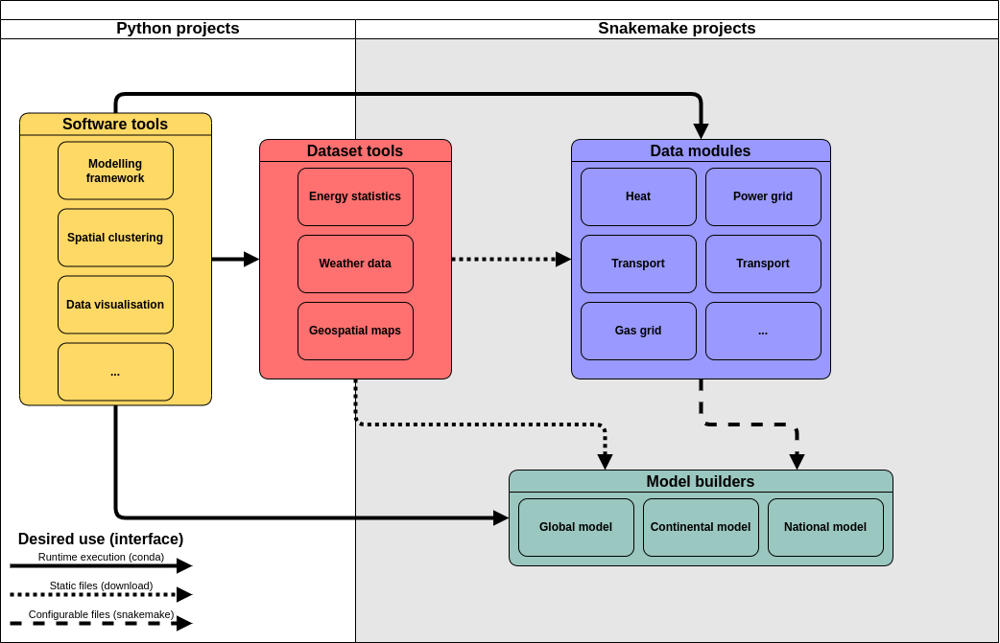

# Our framework

We distinguish four main types of components.

- **Software tools**: general-purpose libraries or tools that can be used in other projects via package managers (conda), offering standardised solutions to commonly seen problems. Since users interact with them through code, they must focus on portability, good documentation, and exhaustive testing.
- **Dataset tools**: these tools are used to create data for re-use in a broad range of cases. The key distinguishing feature of dataset tools as opposed to software tools or data modules is that they generate a single set of data as output, with no user configuration (although these data can evolve through time, so they are versioned). They can vary widely on their methodological complexity, so the choice of programming language or tool used for them should be assessed in a case-by-case basis. Users usually only ever need to interact with the resulting data and will rarely need to run these tools directly.  A higher focus is put on following FAIR principles, solid metadata standards, and thorough data validation.
- **Data modules**: topic-specific data-generating workflows that can be configured to produce case-specific data, allowing users to tune certain assumptions via configuration files or by through input data. These modules follow a commonly agreed input/output structure, their methodology is well documented, and they rely on datasets and software libraries that are trustworthy and stable. This is achieved through a standardised template that all data modules must follow.
- **Model builders**: study-specific workflows that combine the outputs of all other types of components to produce an energy systems model aiming to answer a particular research question. They are highly heterogeneous in their components and are tailored to generating a model for a specific modelling framework.

