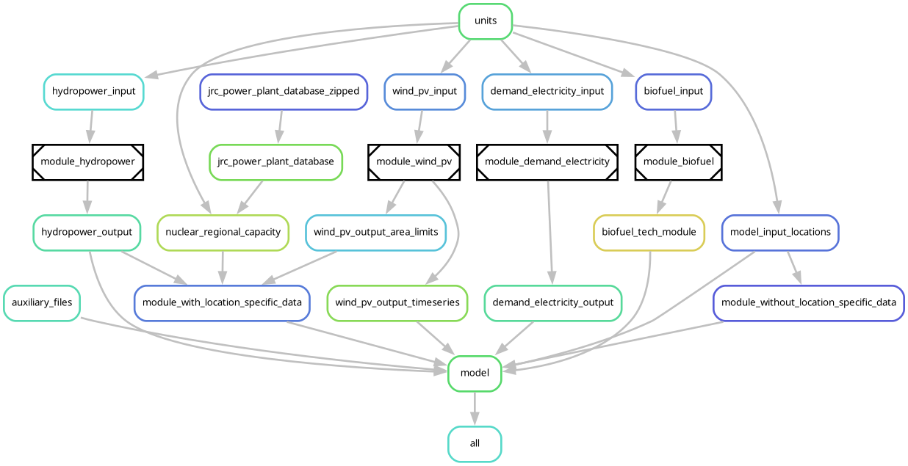

# Home

Welcome to the [`data-module-template`](https://github.com/calliope-project/data-module-template) repository!

Our main purpose is enabling energy researchers and institutions to share, reuse and improve the data workflows used to construct Energy System Models in a decentralised way.
We aim to do this by providing an expanding collection of high-quality modular workflows used for peer-reviewed research, inspired by `snakemake`'s [workflow catalog](https://snakemake.github.io/snakemake-workflow-catalog/).

In essence, we wish to turn very complex models that are hard to maintain and reuse into a range of digestible, well supported tools that get better and better over time!

## For users

Feel free to check our [user guide](./user_guide/getting_started.md)!

## For developers

Please check out our [development guide](./development_guide/getting_started.md).
